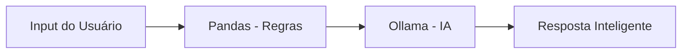

# 🔐 SOCIA — Agente de Cibersegurança com IA Local

<p align="center">
  
  
  
  
</p>

<p align="center">
  <b>Agente inteligente para análise de eventos de cibersegurança utilizando IA local</b>
</p>

---

## 🚀 Sobre o Projeto

O **SOCIA** é um agente de cibersegurança que analisa eventos (logs) e identifica possíveis ameaças utilizando uma abordagem híbrida:

- 📊 Regras com **Pandas**
- 🧠 Inteligência Artificial local com **Ollama**

O sistema classifica riscos, explica o problema em linguagem simples e sugere ações práticas — tudo **100% local**, sem dependência de APIs externas.

---

## ✨ Funcionalidades

- 🔍 Análise de logs de segurança  
- ⚠️ Classificação de risco (baixo, médio, alto)  
- 📌 Explicação clara do incidente  
- 🛠️ Recomendações práticas  
- 🧠 IA local (sem custo)  
- 💻 Interface interativa com Streamlit  

---

## 🧠 Arquitetura


---

## 🛠️ Tecnologias
- 🐍 Python
- 📊 Pandas
- 🧠 Ollama
- 🌐 Streamlit
- 📁 JSON / CSV

---

## 📂 Estrutura do Projeto

AgenteIA/
│
├── app.py                 # Interface Streamlit
├── main.py                # Execução via terminal
├── logs.csv               # Dados de eventos
├── users.json             # Perfil de usuários
├── suspicious_ips.json    # IPs suspeitos

---

## ▶️ Como Executar
### 📦 1. Instalar dependências

```mermaid
pip install streamlit pandas requests
```

---

### 🧠 2. Iniciar IA local (Ollama)

```mermaid
ollama run llama3
```

---

### 💻 3. Rodar interface

```mermaid
streamlit run app.py
```

---

### 🧪 Exemplo de Entrada

```mermaid
{
  "user": "gabriel",
  "ip": "185.220.101.45",
  "location": "Russia",
  "time": "03:12",
  "action": "login_failed",
  "attempts": 5
}
```

---

### 📤 Exemplo de Saída

```mermaid
⚠️ Risco: alto

📌 Motivo:
Múltiplas tentativas de login e acesso de localização incomum.

🛠️ Recomendação:
- Bloquear o IP
- Redefinir senha
- Ativar autenticação em dois fatores
```

---

## 🎯 Objetivo
- Demonstrar aplicação prática de IA
- Simular um assistente SOC (Security Operations Center)
- Criar um projeto funcional para portfólio

---

## ⚠️ Limitações
- Dados simulados
- Não opera em tempo real
- Não substitui soluções profissionais

---

## 🚀 Melhorias Futuras
- 📊 Dashboard com histórico
- 🔔 Sistema de alertas
- 🌐 Integração com APIs reais
- 🤖 Modelos mais avançados

👨‍💻 Autor

Gabriel Silva
<p align="center">  </p>
