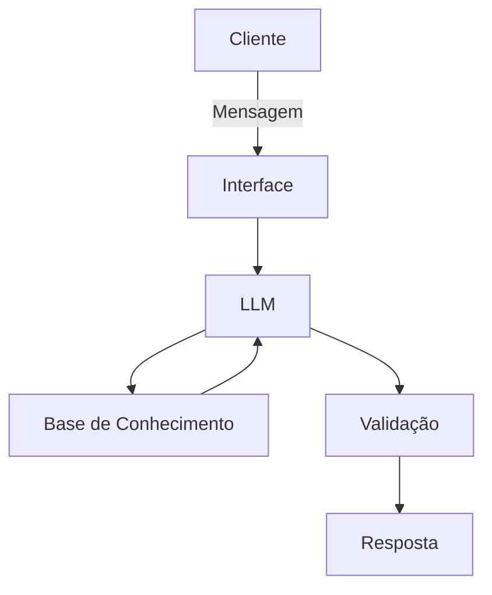

# Documentação do Agente

## Caso de Uso

### Problema

Equipes de segurança e usuários frequentemente enfrentam dificuldades para interpretar logs e alertas de cibersegurança, o que pode levar à demora na identificação de ameaças reais ou à ignorância de riscos importantes.

Além disso, há um grande volume de eventos gerados diariamente, tornando o processo de análise manual lento, complexo e sujeito a erros.

### Solução

O agente atua como um assistente inteligente de segurança, analisando automaticamente eventos e logs para:

Identificar comportamentos suspeitos
Classificar o nível de risco (baixo, médio ou alto)
Explicar o problema em linguagem simples
Sugerir ações corretivas e preventivas

Ele reduz o esforço humano e acelera a tomada de decisão, funcionando de forma semelhante à BIA da Bradesco, porém focado em cibersegurança.

### Público-Alvo

- Estudantes de tecnologia e cibersegurança
- Pequenas e médias empresas sem equipe especializada
- Analistas iniciantes de segurança (SOC)
- Usuários comuns que desejam entender riscos digitais

---

## Persona e Tom de Voz

### Nome do Agente
SOCIA (Security Operations Center Intelligent Assistant)

### Personalidade

O agente possui uma personalidade consultiva, analítica e educativa, atuando como um analista de segurança que:

- Explica decisões de forma clara
- Orienta o usuário com boas práticas
- Evita linguagem excessivamente técnica quando desnecessária
- Prioriza clareza e ação

### Tom de Comunicação

Tom semi-formal, técnico e acessível, equilibrando precisão técnica com linguagem compreensível.

### Exemplos de Linguagem
- Saudação: "Olá! Vou analisar esse evento de segurança para você."
- Confirmação: "Entendi. Já estou verificando os detalhes desse acesso."
- Erro/Limitação: "Não tenho informações suficientes para uma análise completa, mas posso te orientar com base nos dados disponíveis."

---

## Arquitetura

### Diagrama

### Componentes

| Componente           | Descrição                                                    |
| -------------------- | ------------------------------------------------------------ |
| Interface            | Chatbot interativo (ex: Streamlit ou Web)                    |
| LLM                  | Modelo de linguagem via API (ex: GPT)                        |
| Base de Conhecimento | Dados simulados de logs e eventos de segurança (JSON/CSV)    |
| Validação            | Regras de segurança + checagem de consistência das respostas |

---

## Segurança e Anti-Alucinação

### Estratégias Adotadas

- Agente responde apenas com base nos dados fornecidos
- Classificação de risco baseada em regras simples + IA
- Quando não possui dados suficientes, informa limitação
- Evita conclusões sem evidência clara

 Sugere ações baseadas em boas práticas de segurança

### Limitações Declaradas

- Não substitui um especialista em cibersegurança
- Não realiza monitoramento em tempo real
- Não executa ações automáticas (como bloquear acessos)
- Não garante detecção de todas as ameaças
- Não acessa dados externos sem integração específica
